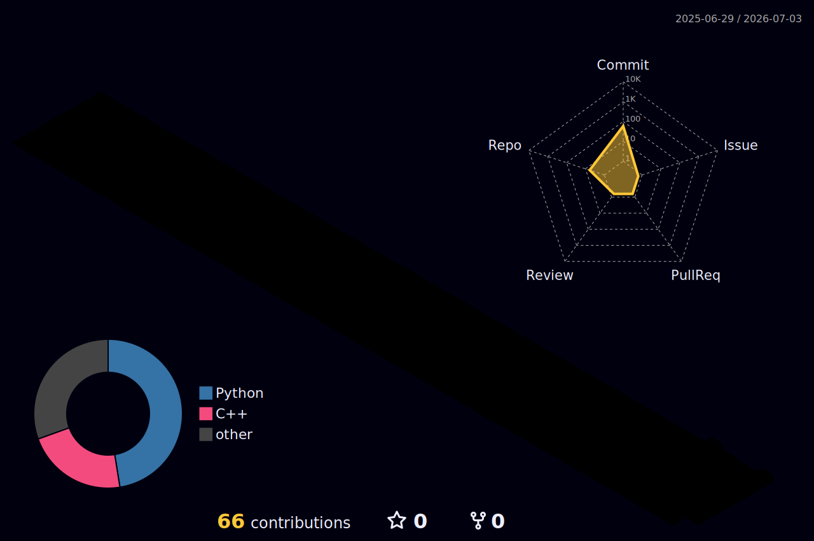

# Hi, I'm Tanmay Singh 👋

B.Tech CSE (AIML) · 4th Year · VIT Bhopal

I build projects at the intersection of AI and systems programming — from multi-agent RAG pipelines with LangChain and LangGraph to concurrent systems and relational databases in C++. Currently preparing for campus placements with a focus on AI engineering.

---

### Languages

### Agentic AI & RAG

### Tools & Databases

---

### Projects

**Order Management System** *(in progress)* `C++ · MySQL · MySQL Connector/C++`
- Designing a 3NF-normalized relational schema (customers, products, orders, order_items) with primary, foreign, and composite keys to eliminate data redundancy and enforce referential integrity.
- Implementing atomic order placement using SQL transactions with commit/rollback, guaranteeing consistency under partial failures (e.g., insufficient stock) so no order is ever left half-written.
- Building a C++ data-access layer using prepared statements to prevent SQL injection, with RAII-based connection handling for safe resource cleanup.
- Using the InnoDB engine to support ACID-compliant transactions across multi-statement order operations.

**Concurrent Seat Reservation System** *(in progress)* `C++ · POSIX (Shared Memory, Semaphores)`
- Building a multi-process seat-booking system using POSIX shared memory (mmap) for inter-process communication, with booking agents spawned via fork.
- Eliminating double-booking race conditions by guarding the critical section with semaphores, demonstrating mutual exclusion across concurrent processes.
- Reproducing and resolving a classic race condition (lost-update problem) to demonstrate the need for synchronization on shared state.
- Adding signal handling for clean release of shared-memory and semaphore resources on process termination.

**Multi-Agent RAG Workflow** *(in progress)* `Python · LangChain · LangGraph · ChromaDB · FastAPI · GCP`
- Developing a production RAG-powered document assistant with a multi-agent architecture using LangGraph for stateful, multi-step reasoning workflows.
- Agents communicate through a shared state graph — a retrieval agent fetches relevant chunks from ChromaDB, a grading agent filters low-relevance results, and a generation agent synthesizes the final answer.
- Exposing the pipeline via a FastAPI REST API with automated CI/CD deployment on GCP.

---

